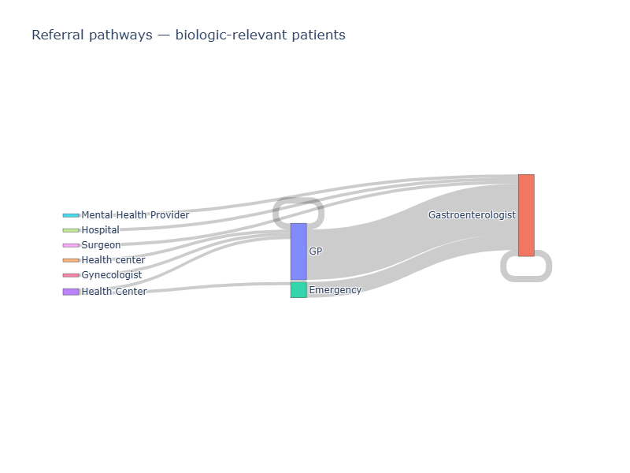

## Overview 

This project is an LLM-based extraction pipeline that transforms 50 synthetic Crohn's disease patient interview transcripts into structured records. Its goal is to answer four commercial questions for PharmaCorp about the biologic treatment landscape, including adoption rates, barriers to biologic use, pre-biologic treatment patterns, and referral pathways. The pipeline prioritizes evidence-based extraction with verbatim grounding or a reasoning trace for every field, while remaining honest about uncertainty and incomplete patient journeys where they occur.


## Setup & How to Run

Requires Python 3.11+


```bash
git clone https://github.com/iyadh-bcl/mama-health-DS-challenge
cd mama-health-DS-challenge
cp .env.example .env      # (optional) add your Gemini API key — only needed for fresh API calls — cache included, see below
```


**With uv (recommended):**


```bash
uv venv
source .venv/bin/activate  # Windows: .venv\Scripts\activate
uv pip install -r requirements.txt
```

**With pip:**


```bash
python -m venv venv
source venv/bin/activate  # Windows: venv\Scripts\activate
pip install -r requirements.txt
```

**1. Run the pipeline**

```bash
python -m src.pipeline
```

Reads from `data/interviews.json`, writes per-patient checkpoints to `data/processed_patients/`, and compiles `data/results.json`. Re-runs skip already-processed patients — delete `data/processed_patients/` to force a full re-run.

A pre-populated litellm cache is included in `.litellm_cache/`. Running the pipeline with this cache reproduces the exact results reported here without requiring API calls. The cache is tied to the exact prompts and model used — any changes will require fresh API calls and a valid `GEMINI_API_KEY` in `.env`.

**2. Run postprocessing**

```bash
python -m src.postprocess
```

Reads `data/results.json`, enriches records with canonical drug and provider names, writes `data/results_postprocessed.json`.

**3. Run tests**

```bash
pytest tests/
```

Or to run a specific file:

```bash
pytest tests/test_pipeline.py
pytest tests/test_schema.py
pytest tests/test_postprocess.py
```

**4. Run evaluation and analysis** 

Open and run the notebooks in order:
```
src/evaluation.ipynb    # golden-set evaluation (exact match + Jaccard)
src/analysis.ipynb      # business questions Q1–Q4 + Sankey diagram
```

## PharmaCorp's Business Answers

**Q1 — What percentage of patients appear to be on a biologic?**

-   74% (37/50) are on a biologic, all at high certainty
-   -   Of the 13 non-biologic patients, 7 had biologic discussed with no firm decision on adopting or rejecting it, 3 explicitly rejected it, and 3 hadn’t yet reached that stage

**Q2 — For patients not on a biologic, what are the primary reasons?**

-   Cost and insurance are the leading barrier: 58% of non-biologic patients (high certainty)
-   Patient fear (side effects, injections): 33%
-   Doctor choice (watchful waiting, not yet recommending): 25%
-   Access barriers: 8%
-   Barriers are not mutually exclusive: patients often cite multiple
-   9/13 had discussed biologics with no firm decision, suggesting active ongoing conversations rather than closed cases
-   Limitation: barriers are captured at the category level only. The evidence text contains more specific reasons that are not systematically aggregated

**Q3 — What treatments are commonly tried before a biologic?**

-   Among confirmed biologic patients, three drug classes dominate the pre-biologic ladder: immunomodulators (62%), 5-ASA/aminosalicylates (56%), corticosteroids (52%)
-   Most biologic patients had tried all three classes before reaching a biologic
-   Non-biologic patients are concentrated at the 5-ASA (26%) and corticosteroid (22%) stage, with fewer having tried immunomodulators (10%), suggesting they are earlier in the escalation ladder

**Q4 — What does a typical referral pathway look like?**

-   Median 2 steps, mean 1.7, range 1–3 (based on 48 patients who reached biologic consideration)
-   Most common transition: GP → Gastroenterologist (25% of relevant patients)
-   Step counts are likely conservative underestimates: evaluation confirmed some implied specialist visits were missed where the specialty was not explicitly named. A prompt improvement would allow the model to infer the provider type from contextual clues (e.g., "Referred immediately. Colonoscopy at 19 was terrifying" implies a Gastroenterologist visit even without naming one).
-   See Sankey diagram for the full pathway visualisation


<p align="center">
  
</p>

See `src/analysis.ipynb` for detailed results and full frequency tables.


## Pipeline Design & Architecture


### Multi-stage over single-shot

The pipeline uses three focused LLM calls per patient rather than one large prompt:

* Call 1 — Core extraction: journey completeness/churn detection, sociodemographics (age, sex, and years with Crohn's disease), biologic status (yes/no/unknown), and full treatment journey 
* Call 2 — Barrier analysis: reasons and concerns why the patient is not on a biologic, including cost/insurance, patient fear, doctor choice, access barriers, and side effect experience
* Call 3 — Referral pathway: chronological sequence of healthcare providers visited, up to and including the provider who can prescribe a biologic

Each call has a bounded task which reduces prompt complexity and keeps each stage independently testable. Focused, single-purpose prompts are theorized to improve extraction quality by reducing the model's cognitive load. In practice, measuring the single-shot vs. multi-stage tradeoff would require an experimental setup comparing both approaches on a representative sample with appropriate evaluation and computational metrics. The accepted tradeoff is latency (~3x API calls vs single-shot).
  
  
  
  

## Extraction Design — Schema and Prompts 

### Schema Design

 Extraction fields use only two types: enums for categorical values and strings for evidence and reasoning. This keeps the schema simple, validation strict, and LLM outputs predictable.

**Explicit status encoding** Rather than collapsing absence into nulls, the pipeline distinguishes between `not_mentioned`, `not_reached`, `churned`, `discussed_no_decision`, `explicitly_rejected`, and `on_biologic` as first-class enum values. These cover every possible operational outcome for a patient's biologic journey and represent the different clinical realities that matter for PharmaCorp's analysis.

**Evidence vs reasoning split** Evidence fields must be verbatim quotes from the transcript (enforced in prompts and verified post-extraction). Reasoning fields are explicit inferences or explanations grounded in the transcript's context. This makes every extraction auditable and distinguishes fact from inference at the data level.

**Certainty on every field** Every extracted field carries a certainty level: high (explicitly stated), medium (reasonably inferred), low (speculative). This enables sensitivity analysis on all findings and forces the model to be explicit about confidence rather than always asserting facts.


### Prompts

Each prompt follows a consistent structure: role setting, task description, rules, certainty definitions, incomplete transcript handling, output format, and context from previous calls.

**Separation of concerns** Prompt-level instructions define how to think: task definition, uncertainty handling, anti-hallucination rules, and output format. `Field(description=...)` annotations on the Pydantic schema define what to extract per field, and the model is explicitly instructed to adhere to the schema structure. This avoids redundancy and keeps prompts focused.


**Anti-hallucination rules** The model is explicitly instructed not to invent information to fill gaps, and to distinguish between information that was never mentioned, unclear, or not yet reached in the patient's journey.

**Precise task-specific instructions** Clear, unambiguous instructions directly shaped extraction quality. For example, the referral pathway prompt required explicit rules to get consistent results: stopping the pathway at the first specialist who can prescribe a biologic, and recording providers by role rather than name. Without these, the model either continued past the relevant endpoint or returned names like "Dr. Evans" instead of "Gastroenterologist." Prompt precision was iteratively refined based on observed model behavior.

**Output format** Prompts explicitly instruct the model to return only valid JSON, reinforced technically by structured output mode via litellm (see Reproducibility).

Known limitation: no few-shot examples were included. Adding 2-3 examples (incl. edge-cases) per call would likely improve handling of ambiguous cases.


## Post-processing

Drug and health-care provider normalization mappings were built data-first: unique names were extracted by frequency from actual pipeline output, then mapped to canonical forms via two LLM calls (Claude Sonnet 4.6), validated manually. This avoids upfront assumptions about what names the model would produce for this specific dataset. In production, a validated clinical lookup table (e.g., RxNorm for drugs, SNOMED for providers) would replace this approach for robustness and coverage.


## Reproducibility & determinism

-   Structured output mode via litellm forces schema-valid JSON responses, reinforcing the prompt-level output format instructions
-   Temperature=0 is not recommended for Gemini 3 models — it can cause infinite loops and degraded performance. Default temperature (1.0) is used as recommended.
-   Setting a seed with temperature=1.0 does not guarantee identical outputs across runs: two runs produced slightly different drug and provider extractions, confirming that seed alone is insufficient without temperature control.
-   Disk caching is therefore the primary reproducibility guarantee. Once a response is cached, re-runs return identical outputs for all processed patients. Per-patient checkpoint files additionally ensure interrupted runs resume without reprocessing successful extractions.
  


## Reliability, error handling & testing

### Reliability and error handling
* Four-stage fallback per LLM call: direct JSON parse → `json_repair` if malformed → Pydantic schema validation → retry if validation fails. Rate limit errors use exponential backoff (up to 5 retries, starting at 30s). All failures are logged and surfaced to the results ledger, nothing is swallowed silently.

* A lightweight transcript quality check runs before any LLM call: minimum 50 characters and ≥70% alphabetic ratio. Patients failing this check are skipped and logged. In production, a more robust readability check would replace this heuristic.

* An evidence verbatim check runs after all three calls, flagging cases where evidence fields are not substrings of the original transcript. Treated as a quality signal rather than a hard failure mode. 

* A known silent failure mode is Call 1 mis-classification: a false `yes` for biologic status causes Call 2 to be skipped, potentially missing barrier analysis for that patient. This is mitigated by running Call 2 on all `unknown` cases. Low-certainty `yes` cases are not currently re-evaluated: a known limitation.

###  Testing
 30 unit tests across three files:

-   **`test_schema.py`** — Pydantic model schema validation and json_repair integration
-   **`test_pipeline.py`** — conditional Call 2 logic, fatal error handling, transcript quality check, and evidence verbatim check
-   **`test_postprocess.py`** — drug and provider lookup functions, case-insensitivity, and `enrich_record` correctness and immutability

Tests focus on reliability and edge cases rather than happy paths: schema validation against malformed LLM responses, json_repair fallback behavior, and the conditional branching logic are the most critical failure modes.


  

## Evaluation — mini golden set

  **Evaluation Approach:** 9 patients manually annotated: 8 randomly selected complete transcripts and 1 heavily truncated case. Gold labels were drafted with LLM assistance (Claude Sonnet 4.6) and manually inspected against the source transcripts. 

**Metrics:**

-   **Exact match accuracy** for scalar fields (`completeness`, `on_biologic`, `biologic_name`, `age`, `sex`, `years_with_crohns`, `biologic_status_detail`, `pathway_endpoint`)
-   **Jaccard similarity** (intersection over union) for list fields (`treatment_names`, `barrier_categories`, `referral_pathway`) — averaged across 9 patients

**Results:**

-   6/8 scalar fields at 100% accuracy. Both misses on a single patient (P047) where the model returned `not_mentioned` instead of `not_reached` for a churned patient. This is mainly a prompt definition issue: the distinction between `not_mentioned` and `not_reached` needs to be sharpened, particularly for churned transcripts where the biologic topic was likely never reached rather than genuinely absent.
-   `barrier_categories` Jaccard: 1.00 — across all 9 patients
-   `treatment_names` Jaccard: 0.94 — misses are edge cases: a novel treatment combination (P029), a drug extracted for a comorbidity rather than Crohn's directly (P033), and a labeling disagreement* (P034)
-   `referral_pathway` Jaccard: 0.78 — all 4 misses are implied specialist visits where the specialty was not explicitly named in the transcript (e.g., "Referred immediately. Colonoscopy at 19 was terrifying.")

*Note: a treatment mentioned as pending a future discussion was labeled `discussed` in the gold set but the model omitted it. This suggests the schema definition of `discussed` could be sharpened to clarify whether future-tense mentions qualify.


**What this tells us:** the pipeline is solid on biologic status classification and barrier categorization. Treatment extraction is reliable, with occasional edge cases around comorbidity drugs and annotation ambiguity. Referral pathway is the weakest area: the model currently requires explicit provider mentions and misses implied visits, meaning pathway step counts are likely conservative underestimates.

**Limitations of this evaluation:** the golden set is small (9 patients) and consists of overwhelmingly complete transcripts. The pipeline's behavior on truncated journeys is not well covered. The single heavily truncated case is insufficient to draw conclusions about overall churn handling quality.
  
  
## Analysis Methodology

All analysis runs from `results_postprocessed.json`. Each question's methodology is described below.

**Q1 — Biologic prevalence** Biologic status is counted across three certainty tiers (high only / high+medium / all) as a sensitivity check. Two independent signals are compared,`call1.biologic_status` and `call3.pathway_endpoint`, which agree perfectly (37/37 on biologic), serving as an internal consistency check.

**Q2 — Barriers to biologic adoption** Barrier frequencies are reported at both patient-level and mention-level. A limitation of this analysis is that barriers are captured at a high category level (e.g., `patient_fear`, `cost_insurance`) — the free-text evidence fields contain more specific reasons that are not systematically aggregated. A production analysis would define finer-grained subcategories or perform a secondary analysis on the evidence text directly.

**Q3 — Pre-biologic treatment ladder** Treatments split into on-biologic (37) and non-biologic (13) groups. For on-biologic patients, biologic entries are excluded from the treatment count since we are interested in what patients tried  before reaching a biologic. Frequencies are reported at both drug class and individual drug level (a patient who tried multiple drugs from the same class is counted once for that class).

**Q4 — Referral pathway** Filtered to patients who reached biologic consideration (`on_biologic`, `discussed_no_decision`, `explicitly_rejected` — 48 patients).  Patients who never reached biologic consideration (`not_reached`, `not_mentioned`) are excluded as their pathways don't answer the question of steps to a biologic-capable specialist. Transition frequencies and full sequences are computed alongside a Sankey diagram as the primary visualisation.

→ See the Business Answers section for the full results.

## Churn Handling

**Churn distribution** 47/50 transcripts are complete, 1 is likely truncated, and 2 are heavily truncated — a low churn rate that means most findings are based on full patient journeys. Completeness was classified by the LLM in Call 1 based on whether the patient's treatment journey had a clear endpoint, was vague or incomplete, or ended abruptly with very little useful information.

**Absence state separation** Rather than collapsing missing biologic information into a single null, the pipeline distinguishes six states: `not_mentioned`, `not_reached`, `churned`, `discussed_no_decision`, `explicitly_rejected`, and `on_biologic`. These are assigned by the LLM in Call 2 and Call 3 based on explicit transcript evidence or reasoning, and are the primary tool for honest reporting of incomplete journeys.

**Trustworthiness by question**

-   **Q1** — Biologic status is typically stated early and clearly; 49/50 cases were classified at high certainty, 1 at medium certainty (the likely truncated transcript).
-   **Q2** — reliable for the 12 patients with extractable reasons. 
-   **Q3** — reliable. Treatments are mentioned throughout transcripts regardless of completeness; truncation affects the journey endpoint, not the treatment history
-   **Q4** — least trustworthy. Pathway completeness is directly affected by truncation, and evaluation confirmed that implied specialist visits are missed even in complete transcripts. Step counts are conservative underestimates
  
**Limitations and potential improvements are noted inline throughout this README where relevant.**


## AI Assistance & Workflow

**Design (Claude claude.ai):** I had full ownership of problem definition, schema and prompt design, and system architecture, all of which were designed on paper before implementation. I collaborated with Claude as a thinking partner to pressure-test decisions, sharpen reasoning, and catch edge cases. Every design decision in this README reflects my own judgment.

**Implementation (Claude Code):** The codebase was built gradually, component by component, with Claude Code. Before each step, I ensured Claude Code understood the plan and the design decisions behind it. I reviewed every file, understood every line, and directed all adjustments. There is nothing in the codebase I cannot explain or account for.

**Normalization maps:** Drug and provider names were first extracted by frequency from the full pipeline output, then mapped to canonical forms via LLM calls (Claude Sonnet 4.6). The resulting JSON mappings were manually validated against the source data and verified programmatically to ensure complete coverage of all extracted terms.

**Evaluation labels:** Ground truth labels for the 9-patient golden set were drafted with LLM assistance and manually inspected and corrected against the source transcripts.


